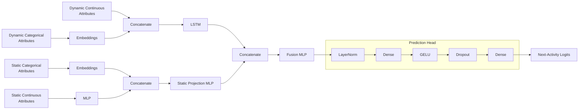

# Predictive Model

The experiments use an LSTM-based neural network for next-activity prediction. The model separately processes dynamic and static trace attributes before combining their representations to predict the next activity at each trace position.

## Architecture



Dynamic categorical attributes are mapped to learned embeddings and concatenated with the dynamic continuous attributes before being processed by the LSTM. Static categorical attributes are also mapped to learned embeddings, while static continuous attributes are processed by a fully connected layer. The resulting static representations are concatenated and passed through a static projection layer.

The static representation is broadcast across the sequence positions and concatenated with the corresponding LSTM representations. The combined representation is passed through a fusion layer and prediction head to produce next-activity logits at each sequence position.

The prediction head consists of layer normalization, a fully connected layer, GELU activation, dropout, and a final fully connected layer producing one logit for each activity class.

## Preprocessing

Categorical attributes are label encoded before being passed to the model. Each categorical attribute is assigned a learned embedding with dimension

```text
min(50, (number_of_categories + 1) // 2).
```

Continuous attributes are scaled using a robust scaler. Static attributes are extracted from the first event of each trace and used as case-level inputs, while dynamic attributes retain their event-level sequence representation.

For a trace containing activities `(a_1, ..., a_T)`, the model inputs contain events `1, ..., T-1`, while the corresponding labels are the activities at positions `2, ..., T`. Traces are padded within a batch, and a mask identifies valid sequence positions.

## Model Hyperparameters

| Hyperparameter | Value | Description |
|---|---:|---|
| Embedding dimension | `min(50, (n_categories + 1) // 2)` | Dimension of each categorical embedding. |
| LSTM hidden size | `128` | Number of hidden units in the LSTM. |
| LSTM layers | `1` | Number of stacked LSTM layers. |
| Static hidden size | `64` | Hidden dimension used for static continuous features and the static projection. |
| Fusion hidden size | `128` | Hidden dimension of the fusion layer. |
| Dropout | `0.1` | Dropout probability used in the network. |
| Output dimension | `n_classes` | Number of activity classes in the corresponding dataset. |

The numbers of dynamic and static categorical and continuous input attributes, categorical cardinalities, and number of output classes are dataset-dependent.

## Training Hyperparameters

| Hyperparameter | Value | Description |
|---|---:|---|
| Loss | Cross-entropy | Next-activity classification loss over valid sequence positions. |
| Optimizer | AdamW | Optimizer used for model training. |
| Learning rate | `0.001` | Initial optimizer learning rate. |
| Weight decay | `0.01` | Weight decay applied to parameters other than biases and normalization parameters. |
| Bias/normalization weight decay | `0.0` | Weight decay for biases and normalization parameters. |
| AdamW epsilon | `1e-8` | Numerical-stability parameter of AdamW. |
| Learning-rate scheduler | CosineAnnealingLR | Cosine-annealing learning-rate schedule. |
| Minimum learning rate | `1e-6` | Minimum learning rate reached by the scheduler. |
| Scheduler period | Number of epochs | `T_max` is set to the total number of training epochs. |
| Training epochs | `100` | Maximum number of training epochs. |
| Gradient clipping | `1.0` | Maximum gradient norm. |

Cross-entropy loss is calculated only over valid, non-padded sequence positions. The learning rate is updated after each epoch using cosine annealing.

## Preprocessing Hyperparameters

| Hyperparameter | Value | Description |
|---|---:|---|
| Continuous scaler | RobustScaler | Scaling applied to continuous attributes. |
| Categorical encoding | LabelEncoder | Integer encoding applied independently to each categorical attribute. |
| Maximum embedding dimension | `50` | Maximum dimension assigned to categorical embeddings. |
| Padding value | `0` | Value used to pad input traces. |
| Label padding value | `-1` | Value used for labels at padded positions. |
| Sequence masking | Enabled | Padded positions are excluded from training and evaluation. |

## Predictive Performance

| Dataset | Accuracy | Macro F1 | Weighted F1 |
|---|---:|---:|---:|
| BPIC2012 | 0.783969 | 0.710430 | 0.776708 |
| BPIC2017 | 0.894618 | 0.842401 | 0.894618 |
| BPIC2019 | 0.815377 | 0.544689 | 0.803974 |
| BPIC2020 International Declarations | 0.872295 | 0.564564 | 0.861658 |
| BPIC2020 Domestic Declarations | 0.862630 | 0.532328 | 0.829747 |
| BPIC2020 Prepaid Travel Cost | 0.875078 | 0.624682 | 0.872302 |
| BPIC2020 Request for Payment | 0.867753 | 0.561960 | 0.846738 |
| Road Traffic Fine Management Process | 0.807665 | 0.697841 | 0.763148 |
| Sepsis Cases | 0.651772 | 0.465518 | 0.645560 |
| Hospital Billing | 0.955854 | 0.705311 | 0.953123 |

Accuracy, macro F1, and weighted F1 are computed over valid, non-padded sequence positions. **Accuracy** is the proportion of positions for which the predicted activity matches the true next activity. **Macro F1** is the unweighted mean of the class-wise F1 scores, giving equal importance to frequent and infrequent activity classes and therefore making performance on underrepresented activities more visible. **Weighted F1** is the mean of the class-wise F1 scores weighted by the number of true instances of each activity class, thereby accounting for class frequency.